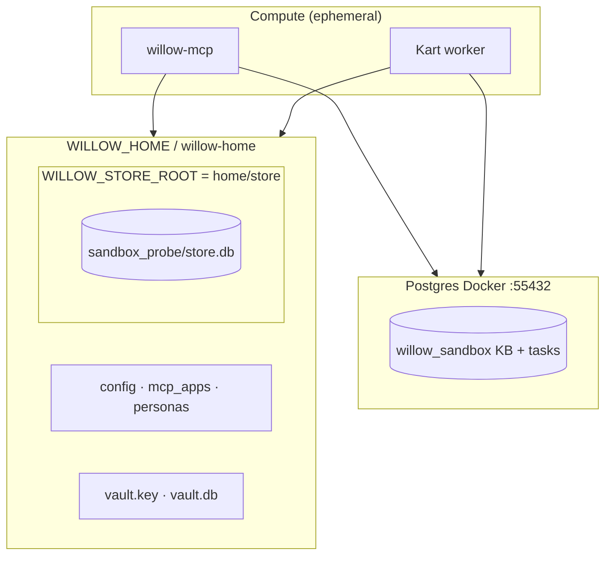
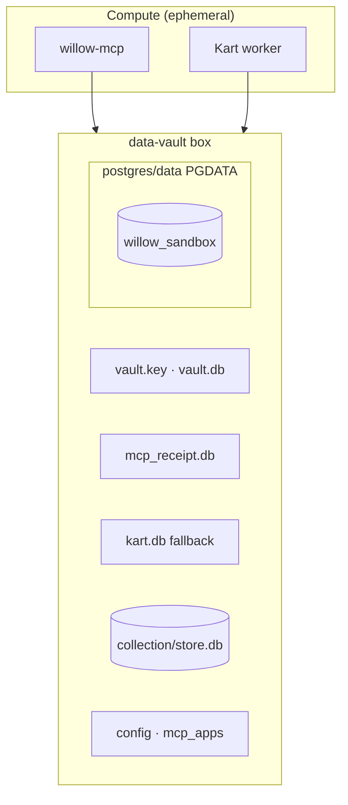
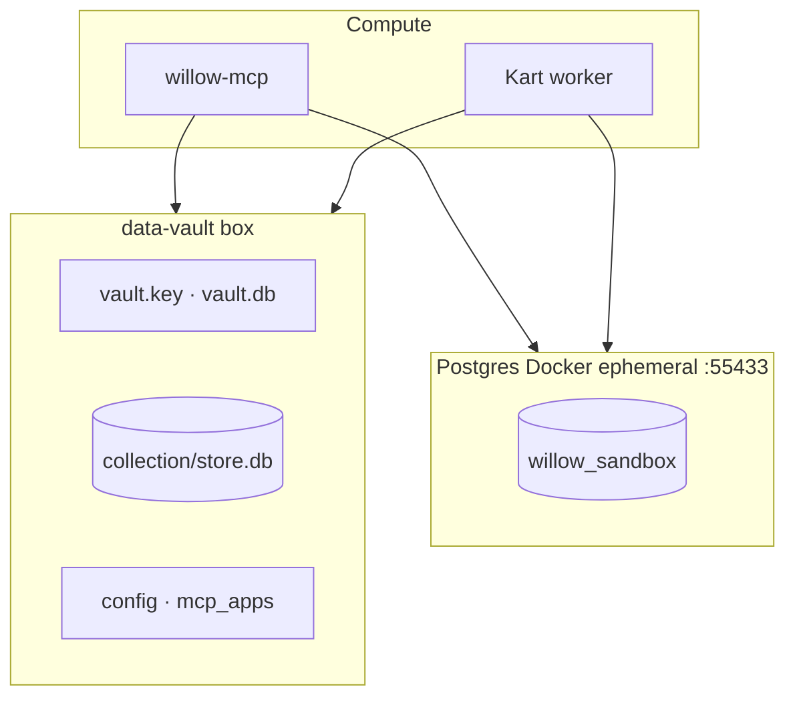

# Sandbox layout I/O

**Canonical model: [vault-full](#l2--vault-full-user-data-vault)** — validated by `sandbox-layout-drive.sh` (2026-07-21). User-facing diagram: [willow-new-user-draft.drawio](../willow-new-user-draft.drawio).

Measured against acceptance criteria in [acceptance.md](acceptance.md).

## What we measure (every layout)

| Signal | Source | Pass |
|--------|--------|------|
| Doctor | `diagnostic_summary` | `ok` / not `broken` |
| Store | `store_stats` | no error |
| Secrets | Fernet `vault.db` + `vault.key` | roundtrip |
| SOIL | `store_put` → `<store_root>/<collection>/store.db` | file exists |
| KB | `schema_confirm` + ingest + search | probe atom found |
| Kart K1 | `task_submit` | `pending` |
| Kart K2 | `worker --once` | `completed` + stdout |
| Gate G4 | `task_submit allow_net` | denied |
| Reuse | second smoke run | exit 0 |

---

## L1 — `hub` (willow-home)

Config + secrets at home; SOIL under `store/`; Postgres ephemeral (Docker, no PGDATA in tree).



| Path | Role |
|------|------|
| `.sandbox-layout-hub/willow-home/` | `WILLOW_HOME` |
| `.../willow-home/store/` | `WILLOW_STORE_ROOT` |
| Docker `willow-sandbox-pg` | Postgres (not in git tree) |

**Matches today’s willow-mcp default** (`WILLOW_STORE_ROOT=$WILLOW_HOME/store`).

---

## L2 — `vault-full` ({user}-data-vault target)

Single sovereign box: `WILLOW_HOME == WILLOW_STORE_ROOT`; Postgres PGDATA inside box.



| Path | Role |
|------|------|
| `.sandbox-vault/data-vault/` | `WILLOW_HOME` == `WILLOW_STORE_ROOT` |
| `.../postgres/data/` | Docker volume → PG 16 |
| `willow-data-vault/bootstrap/provision.sh` | Seeds receipts + kart.db + vault.key |

**Matches [willow-data-vault README](https://github.com/rudi193-cmd/willow-data-vault)** + diagram `{user}-data-vault`.

---

## L3 — `vault-external` (split data plane)

Vault box for SQLite stores + secrets; Postgres outside box (system-service shape).



**Use when:** PG is a host/VM service (Phase 1) and the portable boundary is secrets + SOIL only.

---

## Run comparison

```bash
cd ~/github/willow/design/architecture/sandbox
source ~/github/willow-mcp/.venv/bin/activate
GITHUB_ROOT=~/github ./sandbox-layout-drive.sh
cat LAYOUT-DRIVE.md
```

Single layout:

```bash
./sandbox-smoke.sh --fresh                          # hub
./sandbox-vault-smoke.sh --fresh                    # vault-full
./sandbox-smoke.sh --vault --vault-external-pg --fresh
./sandbox-layout-drive.sh                           # all three + comparison table
```

---

## Recommendation (drive 2026-07-21)

Measured via `sandbox-layout-drive.sh` on this host:

| Layout | Fresh | Reuse | Doctor | Kart | Data plane | Disk |
|--------|-------|-------|--------|------|------------|------|
| **hub** | 11s | 10s | ok | completed | secrets+SOIL+KB | ~384K |
| **vault-full** | 27s | 10s | ok | completed | secrets+SOIL+KB+PG in box | ~408K |
| **vault-external** | 11s | 10s | ok | completed | secrets+SOIL+KB, PG outside | ~400K |

All three pass every acceptance signal we measure (A3, G2–G4, K1–K2, data-plane probe).

| Criterion | hub | vault-full | vault-external |
|-----------|-----|------------|----------------|
| Sovereign portable boundary | partial | **best** | good |
| PG survives `docker rm` | no | **yes** | no |
| Matches willow-data-vault blueprint | no | **yes** | partial |
| Fresh bootstrap time | **fastest** | slowest (+provision) | fast |
| Operator friction (PGDATA perms) | **low** | medium | **low** |
| Phase 1 VM target | migrate | **native** | stepping stone |

**Pick:**
- **Phase 0 cloud agent / dev:** `hub` or `vault-external` (fast fresh, low friction)
- **New-user draft / Phase 1 VM:** **`vault-full`** — one copyable box with secrets, SOIL, receipts, and Postgres PGDATA
- **Stepping stone:** `vault-external` when you want the vault box now but Postgres stays a host service
