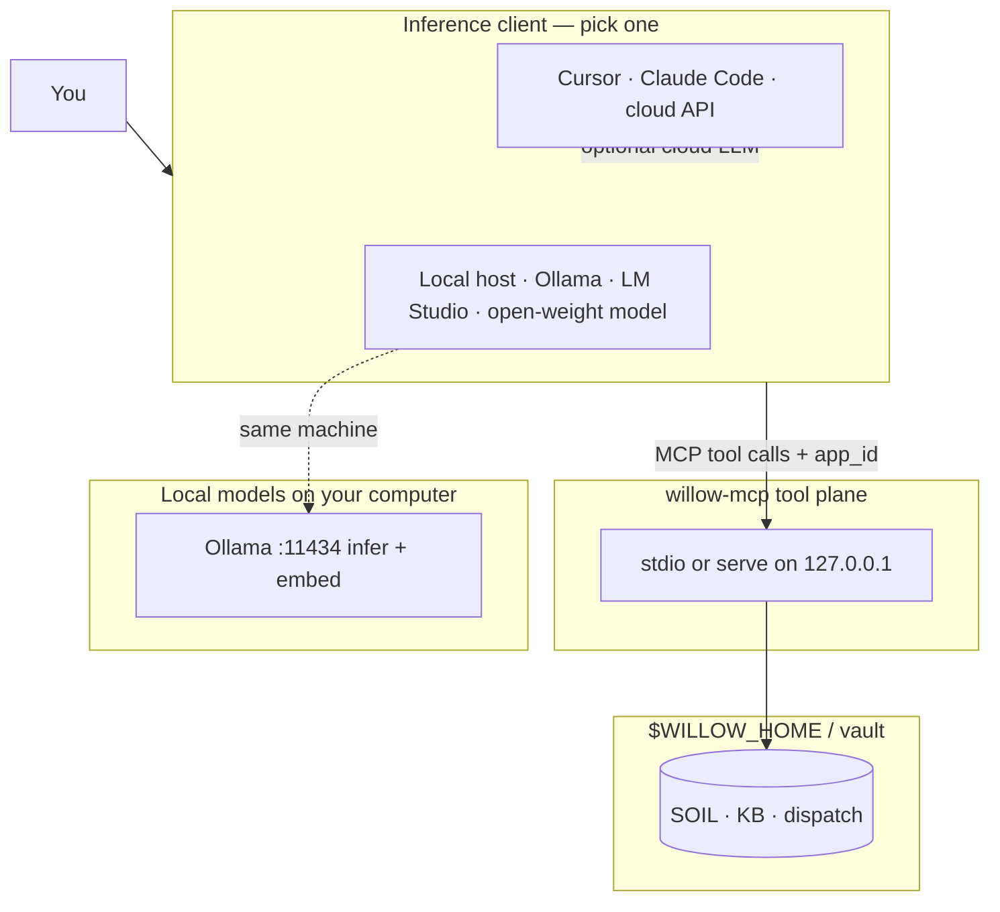
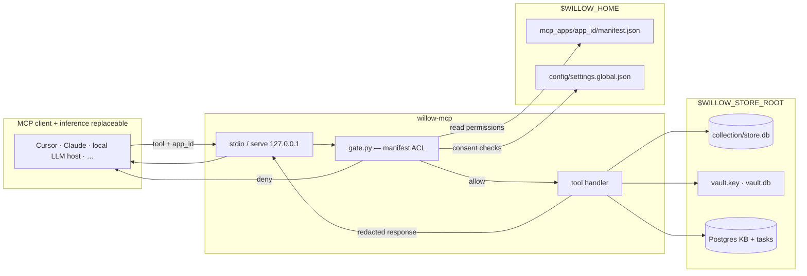
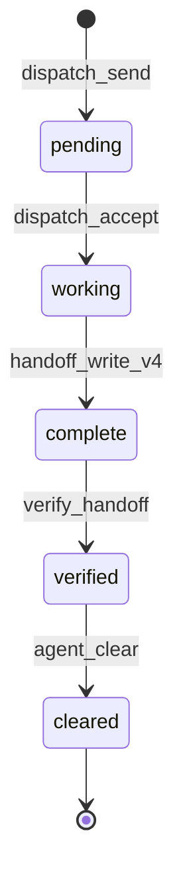
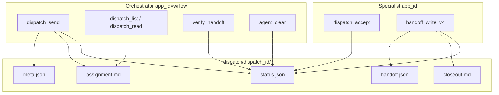
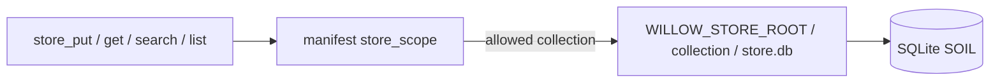
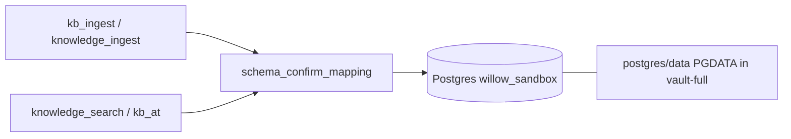
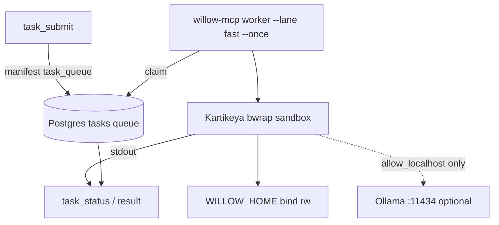
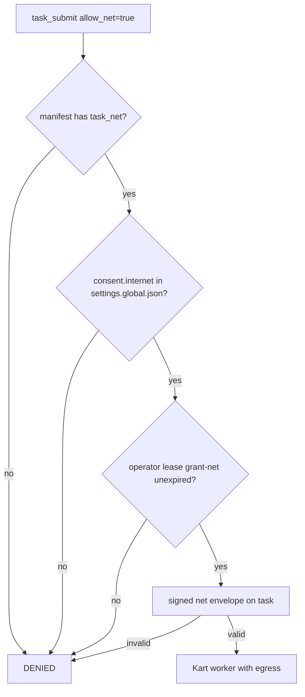
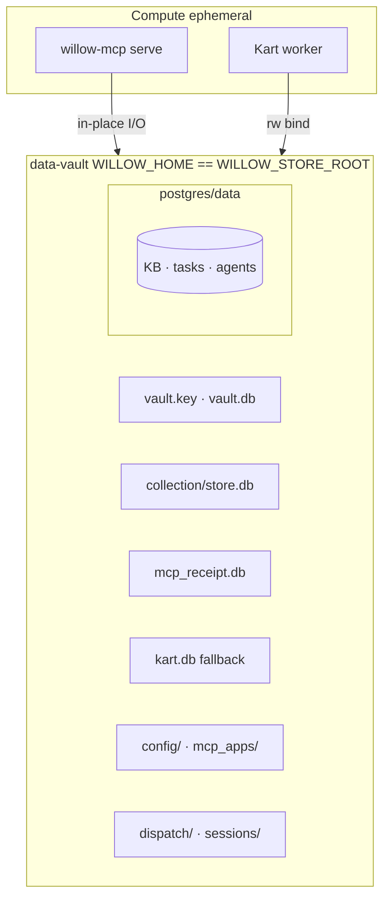
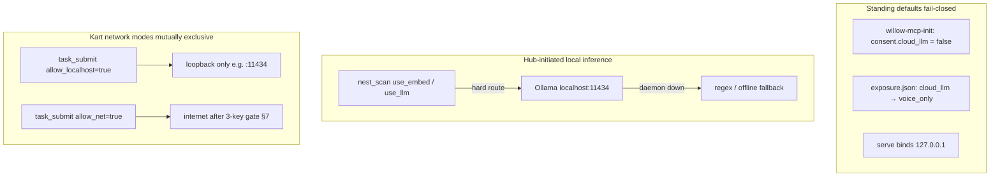

# willow-mcp — individual flow charts

MCP-only I/O: no Willow bench, SAFE store, or optional app repos. For the full new-user picture see [willow-new-user-draft.drawio](willow-new-user-draft.drawio). Canonical runtime layout: [willow-mcp `product-layout.md`](https://github.com/rudi193-cmd/willow-mcp/blob/master/docs/design/product-layout.md).

**Validated layout:** vault-full (`WILLOW_HOME == WILLOW_STORE_ROOT`) — see [sandbox/SANDBOX-LAYOUTS.md](sandbox/SANDBOX-LAYOUTS.md).

**Inference vs tools:** willow-mcp is the **tool plane** (memory, dispatch, Kart, gate). The **inference client** that calls it (Cursor, Claude Code, Discord bridge, or a large local model on the same machine) is replaceable and sits outside the hub.

---

## 0. Inference client (replaceable)

The MCP client and the model that reasons are one seat from the operator's view, but architecturally they are **not** willow-mcp. Any host that speaks MCP can drive the same hub.

| Client shape | Typical stack | Notes |
|--------------|---------------|-------|
| **Cloud IDE** | Cursor / Claude Code → vendor API | Default onboarding picture; needs `consent.cloud_llm` if the vendor is off-machine. |
| **Local-first** | Open WebUI / Continue / custom agent → `localhost:11434` | Same MCP config pointing at `willow-mcp`; reasoning never leaves the box. |
| **Hybrid** | Local model for chat, willow-mcp for tools | Common on a workstation with Ollama + vault; hub stays local regardless. |

`willow-mcp serve` binds **127.0.0.1** by default — the tool plane is localhost-hard even when the inference client uses a cloud model.

---

## 1. MCP tool request (every call)

How a single MCP tool invocation moves through the hub.

| Step | What happens |
|------|----------------|
| 1 | Inference client sends tool name + `app_id` (matches manifest seat). |
| 2 | Gate loads `mcp_apps/<app_id>/manifest.json` permissions. |
| 3 | Handler reads/writes SOIL, secrets, or Postgres as allowed. |
| 4 | Response passes through redaction funnel before return. |

The client performs chat/reasoning; willow-mcp performs **authorized I/O** only.

---

## 2. Session entry (`session_enter`)

First MCP call of every session — picks human vs dispatch path.

| `entry_mode` | Typical `app_id` | Closeout tool |
|--------------|------------------|---------------|
| `human_orchestrator` | `willow` (operator seat only) | `session_handoff_write` |
| `human` | specialist, no packet | `session_handoff_write` / `context_save` |
| `dispatch` | specialist + `dispatch_id` | `handoff_write_v4` |

Orchestrator write tools (`dispatch_send`, `verify_handoff`, `agent_clear`) require `WILLOW_HUMAN_ORCHESTRATOR=1` on the host.

---

## 3. Dispatch packet lifecycle

Orchestrator ↔ specialist work loop inside `$WILLOW_HOME/dispatch/{id}/`.

---

## 4. SOIL store I/O (`store_*`)

Per-app KV records under the store root (vault-full: same tree as `$WILLOW_HOME`).

| Env | vault-full | hub layout |
|-----|------------|------------|
| `WILLOW_HOME` | `…/data-vault` | `…/willow-home` |
| `WILLOW_STORE_ROOT` | same as home | `…/willow-home/store` |

---

## 5. Knowledge base (`knowledge_*` / `kb_*`)

Postgres-backed KB when a database is reachable (schema via `schema_confirm_mapping`).

Standalone fallback: SQLite knowledge paths under `$WILLOW_HOME/knowledge/` when PG is absent.

---

## 6. Kart task queue (`task_*`)

Shell work runs out-of-process in bwrap; hub owns the queue. Network is **off** unless explicitly granted (`allow_localhost` for loopback/Ollama, or `allow_net` for internet — see §7 and §9).

Fallback: `kart.db` at store root when Postgres queue is unavailable.

---

## 7. Egress gate (internet)

Three keys must align before a net-enabled task runs.

Egress keypair lives outside the vault: `~/.config/willow-mcp/egress/` (operator-global by design).

For **localhost-only** tasks (Ollama, local APIs), use `# allow_localhost` — see §9.

---

## 8. Hub ↔ vault boundary (vault-full)

What willow-mcp reads and writes in the sovereign box.

Provision: `willow-mcp-init` + optional `willow-data-vault/bootstrap/provision.sh` for greenfield box seed.

---

## 9. Hard routing to local models

Default posture: **local-first, cloud by explicit consent**. Three lanes keep inference and egress on-machine unless the operator escalates.

| Lane | Mechanism | Reaches |
|------|-----------|---------|
| **Inference client** | Operator runs local LLM host instead of Cursor/Claude | Chat/reasoning stays on box; same MCP tools |
| **Hub tools** | `nest/llm.py`, `nest/embed.py` → `OLLAMA_HOST` default `http://localhost:11434` | Embeddings/classification; no cloud path in code |
| **Kart localhost** | `# allow_localhost` + `grant-net --localhost` | Host loopback (typical: Ollama, local HTTP APIs) |
| **Kart internet** | `# allow_net` + consent + lease + signature | Outside world — never the default |
| **Exposure membrane** | `exposure_slice(..., destination=cloud_llm)` | Even when a cloud client is used, seed fields are sliced to `voice_only` unless widened |

Kart bwrap **without** a network directive shares no network namespace — tasks cannot reach Ollama until `allow_localhost` is explicitly granted (same gate family as `allow_net`, localhost-only scope).

---

## Related docs

| Doc | Location |
|-----|----------|
| Session lifecycle design | `willow-mcp/docs/design/session-lifecycle.md` |
| Operator session flow | `willow-mcp/docs/SESSION_FLOW.md` |
| Exposure membrane (AS-8) | `willow-mcp/docs/design/agent-seed.md` §5 |
| Hooks/skills import plan (Option A) | [willow-mcp-hooks-skills-import.md](willow-mcp-hooks-skills-import.md) |
| Kart localhost vs net | `kartikeya` sandbox `allow_localhost` |
| Sandbox smoke (vault-full) | [sandbox/sandbox-vault-smoke.sh](sandbox/sandbox-vault-smoke.sh) |
| Layout comparison | [sandbox/SANDBOX-LAYOUTS.md](sandbox/SANDBOX-LAYOUTS.md) |
