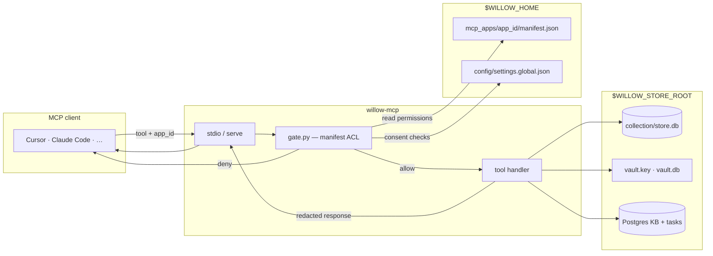
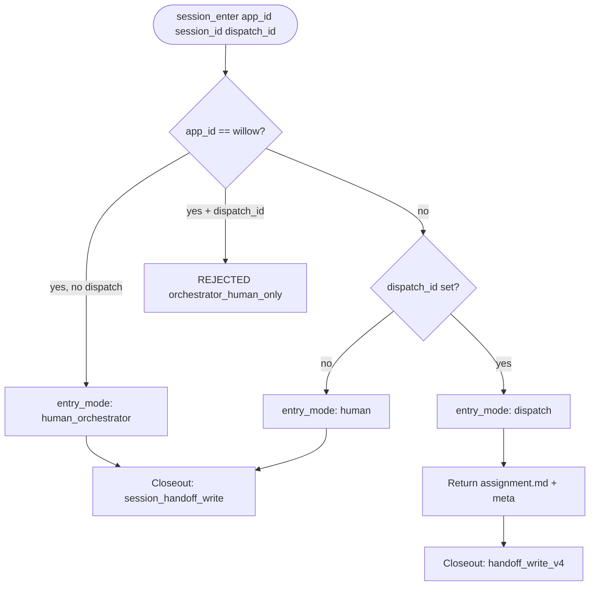
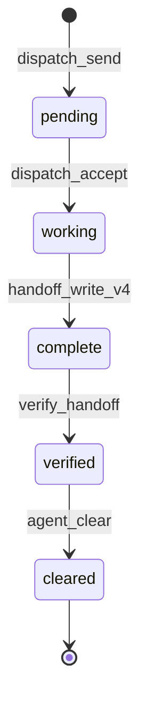
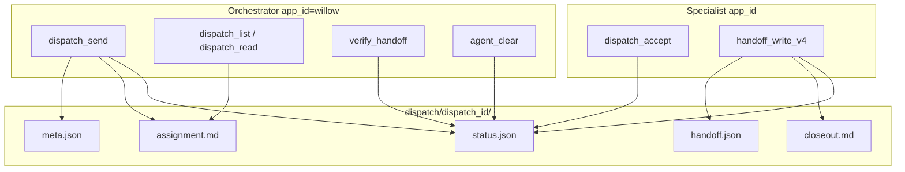
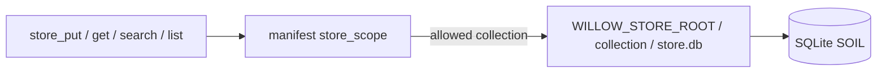
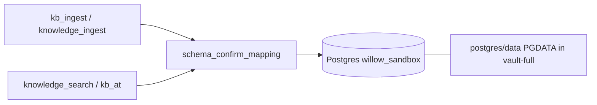
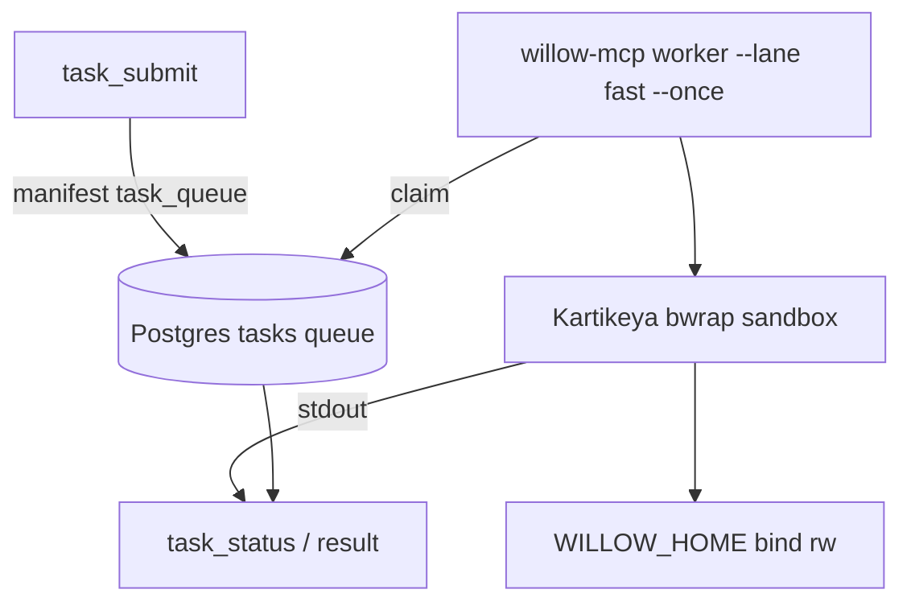
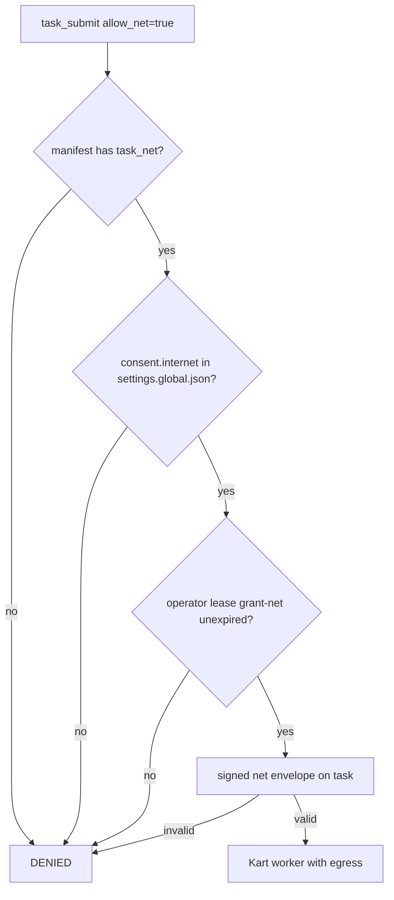
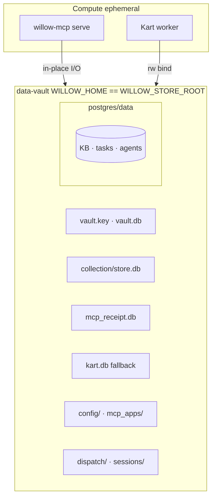

# willow-mcp — individual flow charts

MCP-only I/O: no Willow bench, SAFE store, or optional app repos. For the full new-user picture see [willow-new-user-draft.drawio](willow-new-user-draft.drawio). Canonical runtime layout: [willow-mcp `product-layout.md`](https://github.com/rudi193-cmd/willow-mcp/blob/master/docs/design/product-layout.md).

**Validated layout:** vault-full (`WILLOW_HOME == WILLOW_STORE_ROOT`) — see [sandbox/SANDBOX-LAYOUTS.md](sandbox/SANDBOX-LAYOUTS.md).

---

## 1. MCP tool request (every call)

How a single MCP tool invocation moves through the hub.

| Step | What happens |
|------|----------------|
| 1 | Client sends tool name + `app_id` (matches manifest seat). |
| 2 | Gate loads `mcp_apps/<app_id>/manifest.json` permissions. |
| 3 | Handler reads/writes SOIL, secrets, or Postgres as allowed. |
| 4 | Response passes through redaction funnel before return. |

---

## 2. Session entry (`session_enter`)

First MCP call of every session — picks human vs dispatch path.

| `entry_mode` | Typical `app_id` | Closeout tool |
|--------------|------------------|---------------|
| `human_orchestrator` | `willow` (operator seat only) | `session_handoff_write` |
| `human` | specialist, no packet | `session_handoff_write` / `context_save` |
| `dispatch` | specialist + `dispatch_id` | `handoff_write_v4` |

Orchestrator write tools (`dispatch_send`, `verify_handoff`, `agent_clear`) require `WILLOW_HUMAN_ORCHESTRATOR=1` on the host.

---

## 3. Dispatch packet lifecycle

Orchestrator ↔ specialist work loop inside `$WILLOW_HOME/dispatch/{id}/`.

---

## 4. SOIL store I/O (`store_*`)

Per-app KV records under the store root (vault-full: same tree as `$WILLOW_HOME`).

| Env | vault-full | hub layout |
|-----|------------|------------|
| `WILLOW_HOME` | `…/data-vault` | `…/willow-home` |
| `WILLOW_STORE_ROOT` | same as home | `…/willow-home/store` |

---

## 5. Knowledge base (`knowledge_*` / `kb_*`)

Postgres-backed KB when a database is reachable (schema via `schema_confirm_mapping`).

Standalone fallback: SQLite knowledge paths under `$WILLOW_HOME/knowledge/` when PG is absent.

---

## 6. Kart task queue (`task_*`)

Shell work runs out-of-process in bwrap; hub owns the queue.

Fallback: `kart.db` at store root when Postgres queue is unavailable.

---

## 7. Egress gate (internet)

Three keys must align before a net-enabled task runs.

Egress keypair lives outside the vault: `~/.config/willow-mcp/egress/` (operator-global by design).

---

## 8. Hub ↔ vault boundary (vault-full)

What willow-mcp reads and writes in the sovereign box.

Provision: `willow-mcp-init` + optional `willow-data-vault/bootstrap/provision.sh` for greenfield box seed.

---

## Related docs

| Doc | Location |
|-----|----------|
| Session lifecycle design | `willow-mcp/docs/design/session-lifecycle.md` |
| Operator session flow | `willow-mcp/docs/SESSION_FLOW.md` |
| Sandbox smoke (vault-full) | [sandbox/sandbox-vault-smoke.sh](sandbox/sandbox-vault-smoke.sh) |
| Layout comparison | [sandbox/SANDBOX-LAYOUTS.md](sandbox/SANDBOX-LAYOUTS.md) |
